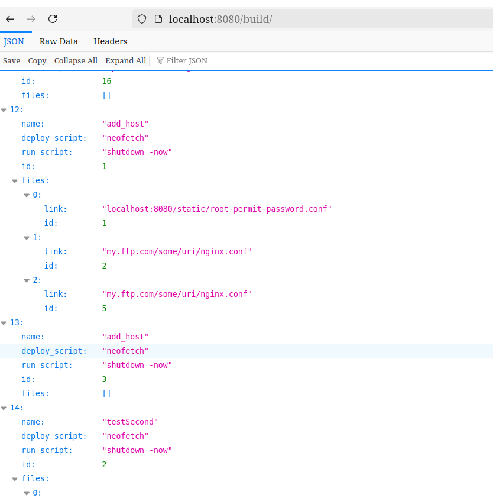
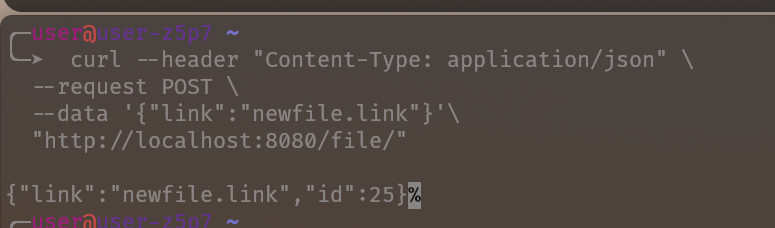
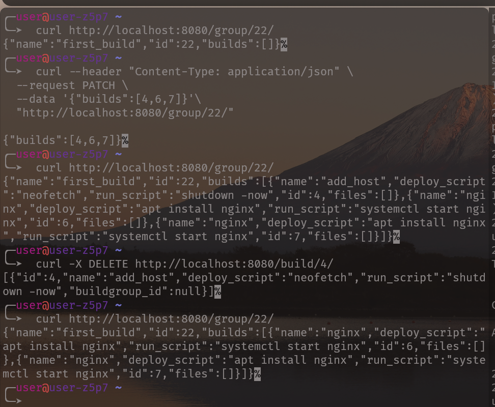
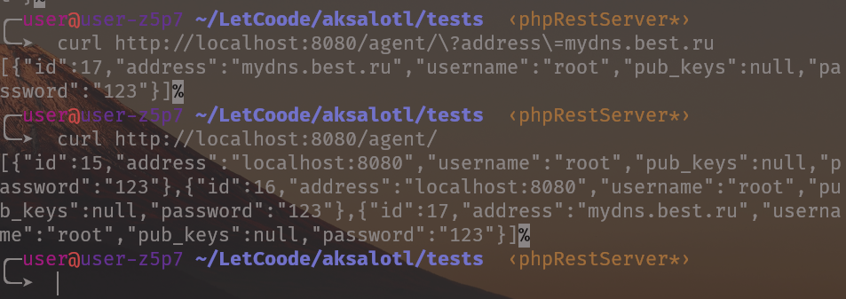
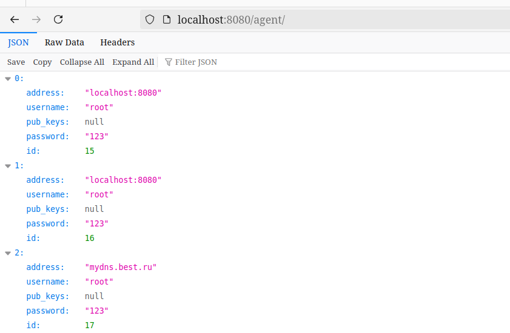
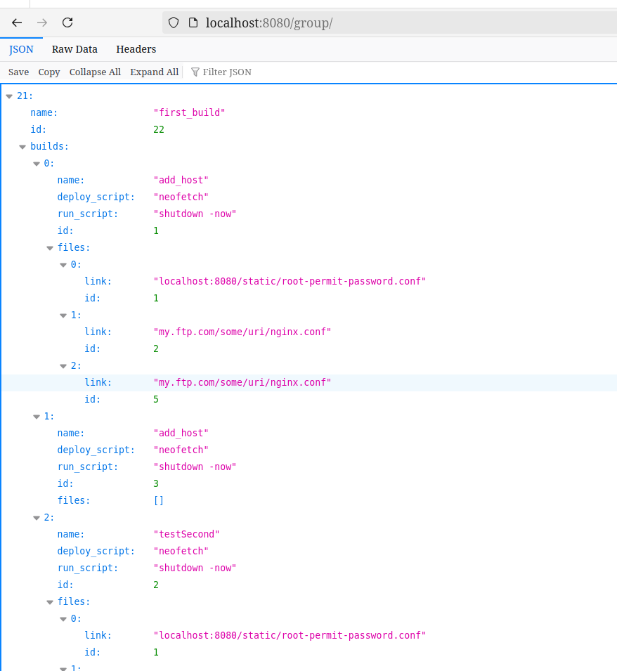
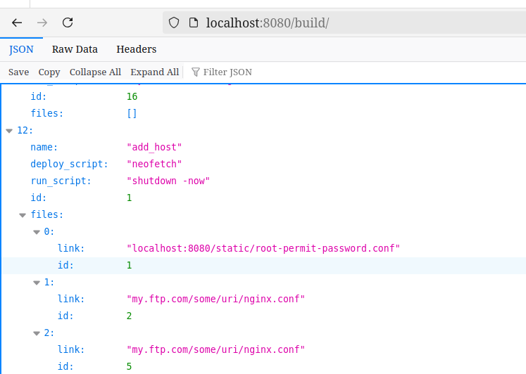
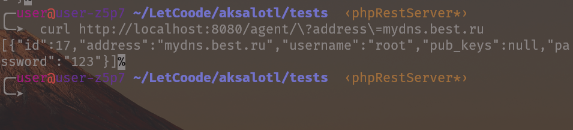
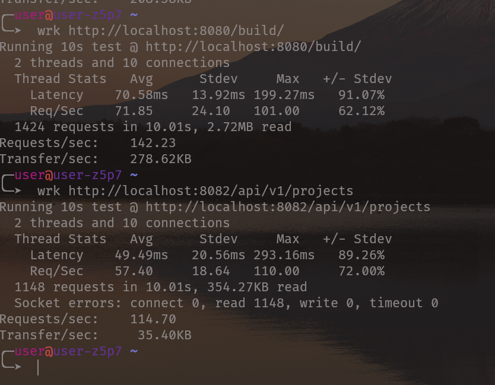

# It's alive, alive!



## About app
--- 
I create instances: **build**, **agent**, **buildgroup**, **file**, **user**.
**build** bounded with **buildgroup** using many-to-many relation, **file** to build too.
**user** just contains user data, it technically bounded with every table by one-to-many relation, to restrict access for different users, but now it's no implementation for identification user from requests.

So, app supports GET, POST, PUT, PATCH and DELETE requests.
* GET request will return all instances on `/` or specified detail on `/id/` about instance.

```shell
 curl http://localhost:8080/file/1/
{"link":"localhost:8080\/static\/root-permit-password.conf","id":1}%  
```
* POST request will create a new instance.

* PUT request like POST, but idempotent
* DELETE will delete instance and return it
    
* PATCH will update existing instance



## About framework
---
Simple PHP acyncronus REST-ORM framework, based on apm-php libs. 

### Installation 
Requires php > 8.0 and [Composer](https://getcomposer.org/).
```shell
git clone https://github.com/CatKap/UndeRESTimate.git
cd UndeRESTimate
composer install 
```


### Run
```shell
php -f Aksa.php
```


## Usage 
--- 
After setting up... 

### Models 
Default classes for models is DefaultModelHandler:
```php
$agentModel = new ModelHandler(
    $pool,
    "AGENT", // DB name
    $schema = [
        // DB fields (must match fields in db)
      'address' => 'STRING', 
      'username' => 'STRING',
      'pub_keys' => 'STRING',
      'password' => 'STRING',
      ],
    $privateFields = [
      'private_key' => 'STRING',
    ]
);
```
PrivateFields are accessible from internal code, but didn't serving to the web.

GET request on this instance, for example:



To create link to the another instance, use
```php
$buildModel = new ModelHandler(
    $pool,
    'BUILD',
    $schema = [
      'name' => 'STRING',
      'deploy_script' => 'STRING',
      'run_script' => 'STRING',
        // Or oneToManyRel, if you want
      'files' => [$fileModel, 'manyToManyRel']
    ]
);


$buildGropModel = new ModelHandler(
    $pool,
    'BUILDGROUP',
    $schema = [
      'name' => "STRING",
      'builds' => [$buildModel, 'oneToManyRel'],
    ]
);
```
Connect model to the handler and set up routes:
```php
$agentView = new RestResponseHandler($logger, $agentModel);
$agentView->setRoutes($router, '/agent/');
```

Group with added buidls:


Build with files:


Adding build to group and deleting one of them causes the deleting object from group (like it should):


Framework support simple query filtration:




### Performance
---
It faster then Django Rest Framework, hah!



